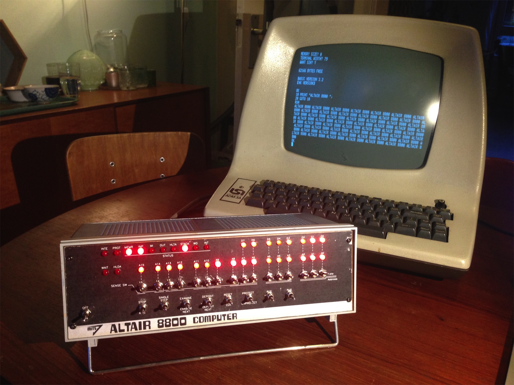
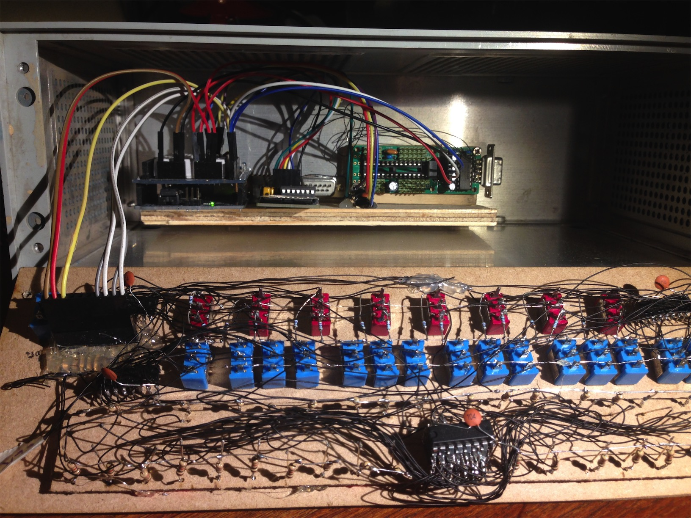

# Altair8800

I first learned about the Altair 8800 when reading about it in the book [The Innovators by Walter Isaacson][1]. In January 1975 this computer kit made its appearance on the cover of the Popular Electronics Magazine (I wasn't evern born back then). It inspired two young guys: Paul Allen and Bill Gates to start a company they called Micro-soft. They build a BASIC interpreter to make this machine more accessible and licensed it to MITS, the company of Ed Roberts who created the Altair 8800.

Soon after reading another great book [Code: The Hidden Language of Computer Hardware and Software by Charles Petzold][2] I really felt the urge of creating a replica of the Altair 8800 myself.

To get a feeling how the Altair was operated I watched a lot of videos on YouTube from the person behind the [Altair Clone][3] project. That way I learned the functions of all the LEDs and toggle switches.

I wasn't sure if I would emulate the hardware components of the Altair or collect real vintage components to create the replica. I desided to first emulate most parts on an Arduino because that's a platform I was already familiar with. May be I will later replace the Arduino by a real [Intel 8080][4] (or 8085) chip on which I got my hands on recently.

I found some good resources, even a project by [Daniel Karling][5] who already emulated the Altair 8800 on an Arduino Uno. I learned a lot by studying his code and PCB schematics. But I didn't want to just copy everything, so I tried to start from scratch, even trying to build my own emulator for the Intel 8080, the core of the Altair 8800. Later I found another well written emulator for the processor by [Alexander Demin][6]. I ended up using code from both projects combined with my own code.

It was not the shortest route but it was great fun and I learned a lot!

Here is a photo of the result: my own Altair 8800 connected to an Lear Siegler ADM-3A terminal. It's a quite bit smaller and a lot lighter than the original Altair 8800. On the photo it's running the 4K-BASIC by Paul Allen and Bill Gates. It can also run CP/M 2.2.



This is how it looks from the inside. I like the amount of wires and the chips piggy-backing but I think next time I will invest some time to dive into KiCAD and learn how to design a real PCB.



# Movie
Here's a movie of me using the Altair on my ADM-3A (in Dutch).
[](http://www.youtube.com/watch?v=Wh4WVTb0bLA)

# Components
The main components I used are: 
- 1x Arduino Uno with prototyping shield
- 4x 74HC595 (shift register for writing LEDs)
- 4x 74HC166 (shift register for reading switches)
- 1x 23LC1024 (128KB RAM using SPI)
- 1x 74HC125 (for connecting SD-card using SPI) (needed?)
- 1x MAX232 to communicate over RS-232 with Terminal

# Pins
| Pin(s)| Description
| ------|------------------------------
| 2,3   | SoftwareSerial port (to connect Terminal through RS232)
| 4     | Chip Select for SD-Card (SPI)
| 5     | Clock for LEDs and switches
| 6     | Chip Select for switches
| 7     | Data Input pin for switches
| 8     | Chip Select for LEDs
| 9     | Data Output pin for LEDs
| 10    | Chip Select for RAM (SPI)

# Install on Arduino
Open the `Altair8800.ino` file in the Arduino IDE and upload it to the Arduino UNO board.

# Install on your computer
You can install the code on your computer instead of an Arduino. This makes is easier to look for errors. It's also faster because you don't have to upload the compiled code to your Arduino after every change. A disadvantage is that you don't the LEDs and the Switches. Check `local/main.cpp` for the code.
```
make
./altair8800
```

# The Front Panel
The Front Panel of the Altair 8800 exists of 16 address LEDs, 8 data LEDs, 8+4 status LEDs. It has 16 address switches, of which 8 can also be used as data entry switches and the other 8 as 'sense' switches for giving user input to a running program. There are 8 spring loaded toggle switches which can be pushed up and down but return to a middle state.


# Kill The Bit
Kill The Bit is a game written Dean McDaniel in May 1975. The purpose of the game is to hit a moving LED by flipping a switch at the right moment. When you hit it, it dies. Everytime you miss an extra light goes on which leaves you with more bits to kill.

The game is only 24 bytes big so it's possible to enter the code by hand by flipping the switches.

Source code, explanation and the octal codes:
http://altairclone.com/downloads/killbits.pdf

Since my emulator is running slower than the origial Altair 8800 you (might) need to change the line LXI B,0Eh to LXI B,0130h.

# ROMs
Instead of manually flipping all the switches to load code into the Altair people installed ROM chips or only programmed a bootloader by hand which then would load the rest of the data from paper-tape, casette or disk. Instead of real ROM chips an SD-card is used in my Altair replica with ROM files on it. For example the file 4KBAS32.BIN is a ROM file which can be copied to RAM from address 0 to 4096. There's a very nice description of the 4K-BASIC assembly-code at http://altairbasic.org.

```
loadFile("4KBAS32.BIN", 0x0000);
examine(0x0000);
run();
```

More ROMs and other files can be found here:
- [VintageComputer.org](http://www.vintagecomputer.net/mits/Software)
- [AltairClone.com](http://altairclone.com/downloads/)

# Disk Images
Beside ROM files you can also find DSK files. DSK files contain a disk image which can be read by a piece of code called the Disk Bootloader (88dskrom.bin). The Altair Disk Bootloader is a ROM chip with 255 bytes of code loaded at address 0xFF00. The Disk Bootloader executes IN and OUT instructions and this way communicates with the disk drive(s). The disks are simulated as files on the SD-card and can be mounted/selected from Arduino code.

```
loadFile("88DSKROM.BIN", 0xff00);
disk_drive.disk1.fp = SD.open("cpm63k.dsk", FILE_WRITE);
disk_drive.disk2.fp = SD.open("zork.dsk", FILE_WRITE);
examine(0xff00);
run();
```

# Intel 8080 instructions
These 2 resources where handy when I was trying to create an Intel 8080 emulator. It shows how the instructions correspond to the opcodes.
- [Intel 8080 instruction set](http://pastraiser.com/cpu/i8080/i8080_opcodes.html)
- [8080 instruction encoding](http://www.classiccmp.org/dunfield/r/8080.txt).

[1]: https://en.wikipedia.org/wiki/The_Innovators:_How_a_Group_of_Inventors,_Hackers,_Geniuses,_and_Geeks_Created_the_Digital_Revolution
[2]: http://www.charlespetzold.com/code/
[3]: http://altairclone.com
[4]: https://en.wikipedia.org/wiki/Intel_8080
[5]: http://dankar.github.io/emulator/2015/04/12/altair-8800-emulator/
[6]: https://github.com/begoon/i8080-core
